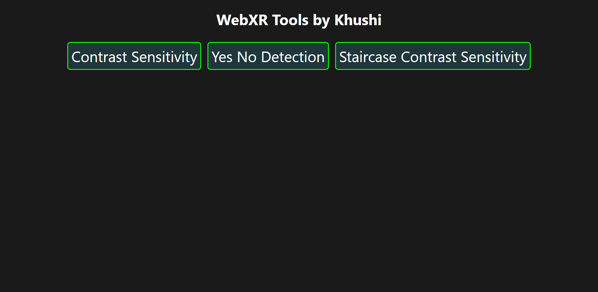
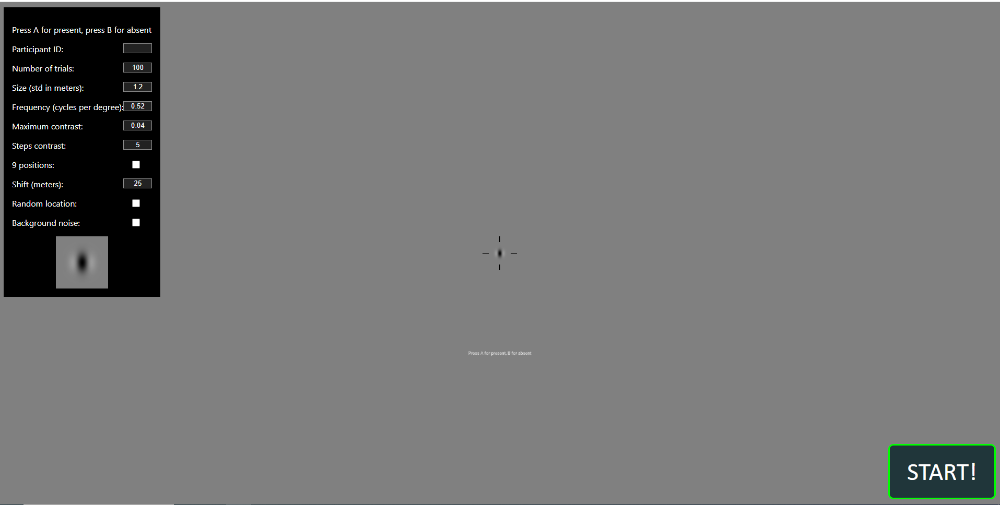
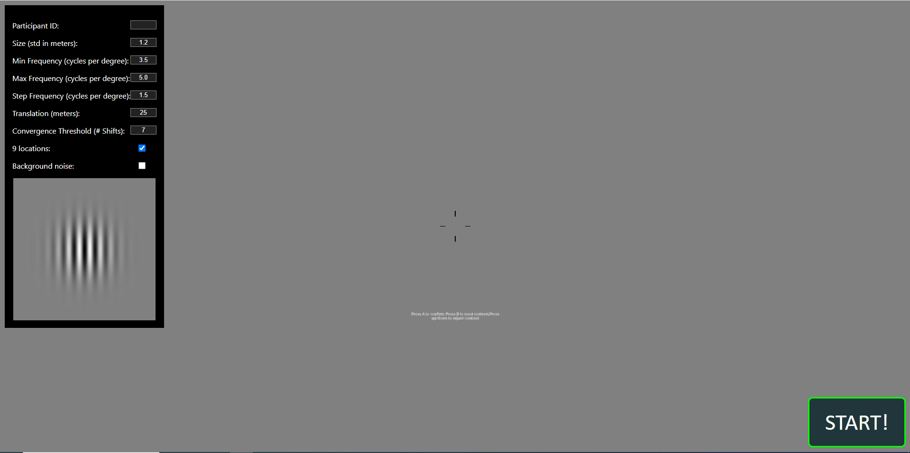

## WebXR-tools

This page contains a few tools and concepts for the use of WebVR in regulatory science. You can try all the experiments [here](https://khushibhansali.github.io/WebXR-tools/).
 

The direct link to the different tools are here:
- [Contrast Sensitivity Tool](https://khushibhansali.github.io/WebXR-tools/exp-detection-contrast-sensitivity/)
- [Detection Tool](https://khushibhansali.github.io/WebXR-tools/exp-detection-yes-no/)
- [Staircase Contrast Sensitivity Tool](https://khushibhansali.github.io/WebXR-tools/stairs/)


The purpose of these experiments is to observe the perceptual performance of participant when factors like gabor size, standard deviation, frequency, and position are changed. There are 3 types of experiments to try.
## Contrast Sensitivity Tool
  - This experiment allows the participant to increase/decrease the contrast of the gabor in order to find the threshold contrast. 
  - Participant can also press a special key to indicate that they couldn't see the gabor at full contrast in a certain size, standard deviation, frequency, and position.  
  - At the end, all the trial data is saved into json file.


## Detection Tool
  - This is a portion correct study where gabor is present 50% of the times.  
  - Participant has to predict when gabor is present and when it is absent with factors like size, standard deviation, frequency, and position being modified. 
  - At the end, a percentange correct score will be calculated and all the data from the trials is saved into a json file.



## Staircase Contrast Sensitivity Tool
  - This experiment uses a staircase method to increment the contrast values of the gabor instead of up/down arrows to reduce human biases. It also flashes the target for 250 miliseconds to prevent other biases as well.
  - The goal is to to find the threshold contrast per position. 
  - At the end, all the trial data is saved into json file.



## To download the repositiory follow these steps:
1. Click on the green code button between add file button and about section. 
2. Download the repositiory as a zip file or use the command line, navigate to destination folder (cd command), and type ```git clone https://github.com/Khushibhansali/WebXR-tools.git```
3. Open the index.html to modify the contents of the webpage. 
4. Open scripts.js to change any logic from the experiments.
5. The lib folder is nessecary for Aframe dependencies.
