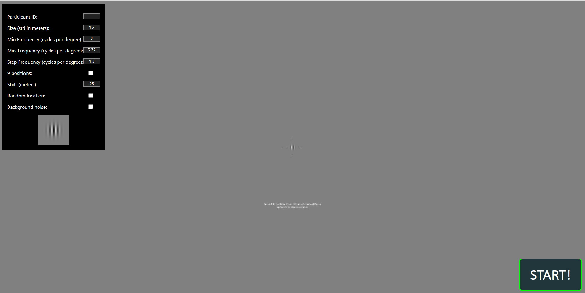
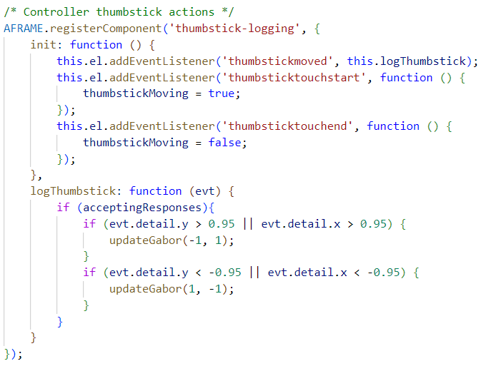
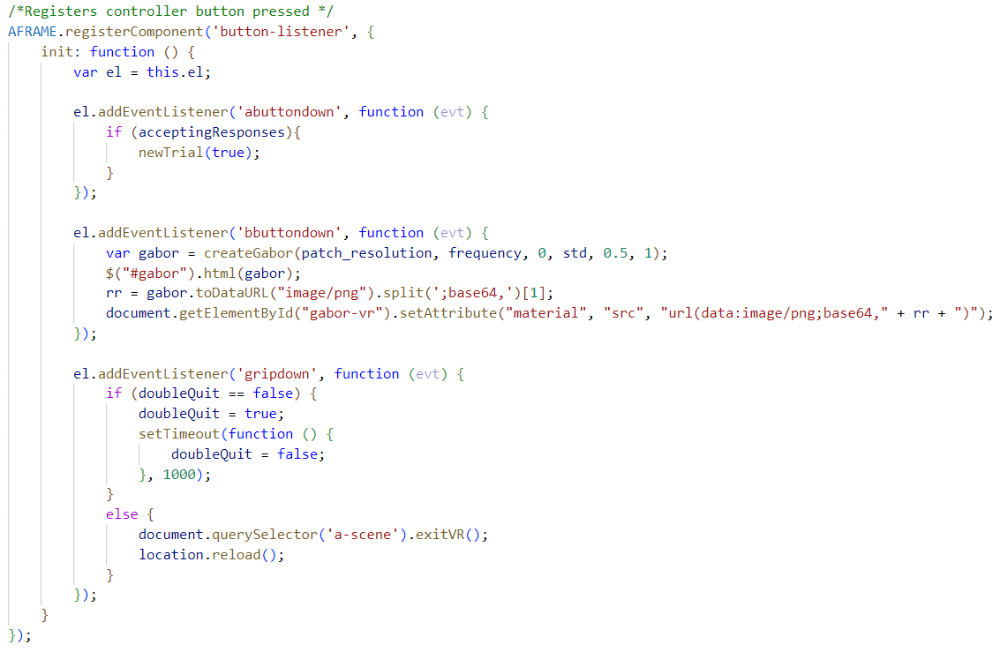

## Contrast Sensitivity

## Setup
You can modify any of the values in the menu using the keyboard or Oculus Quest 2 controller. The experiement will run from the min frequency to max frequency over a fixed position or 9 different positions.  
The min frequency, max frequency and step frequency are measured in cycles per degree meaning that we divide these values by 26 in our code in order to account for the angle between the headset and the target.
Size is the standard deviation of the gaussian distribution of the target measured in meters according to the [WebXR documentation](https://developer.mozilla.org/en-US/docs/Web/API/WebXR_Device_API/Geometry). 
The shift is the distance between targets when they move over 9 positions which is measured in meters according to the [WebXR documentation](https://developer.mozilla.org/en-US/docs/Web/API/WebXR_Device_API/Geometry). 
It is universal, so changing the step when in centering mode will also change the step size when in offset mode. This is all done on the left controller.

## Controls

### Keyboard
- a: Confirm contrast level and move to next target
- b: To reset contrast to 1
- Arrow up: Increase contrast of current target
- Arrow down: Decrease contrast of current target
- esc: Exit immersive mode

### Controllers
**Currently, the only controllers that are supported are the Oculus Quest 2.** 

#### Right Controller Bindings

#### Right Controller: 
- a: Move current segment left
- b: Move current segment right
- trigger: Swap current segment to be one above
- grip: Swap current segment to the one below
- Press in thumbstick: Hide center dot

#### Left Controller:
- menu: Exit VR
