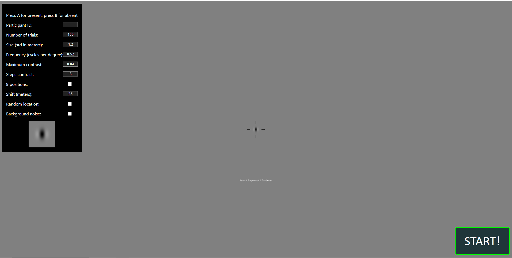

## Detection

## Setup
You can modify any of the values in the menu using the keyboard or Oculus Quest 2 controller. The experiement will run the number of trials specified over a fixed frequency. 
Random location will place the target anywhere within the screen for all trials. The 9 locations will place the target on 9 specific positions based on the shift values. 
The shift is the distance between targets. It is measured in meters according to the [WebXR documentation](https://developer.mozilla.org/en-US/docs/Web/API/WebXR_Device_API/Geometry). 
The frequency is measured in cycles per degree.Size is the standard deviation of the gaussian distribution of the target measured in meters according to the [WebXR documentation](https://developer.mozilla.org/en-US/docs/Web/API/WebXR_Device_API/Geometry). 
The objective is to be able to correctly identify if a target is present or absent given the variable location, contrast, and frequency of the target.

## Controls

### Keyboard
- a: Target is present
- b: Target is absent
- esc: Exit immersive mode

### Controllers
**Currently, the only controllers that are supported are the Oculus Quest 2.** 

#### Right Controller Bindings

#### Right Controller: 
- a: Target is present
- b: Target is absent

#### Left Controller:
- menu: Exit VR
